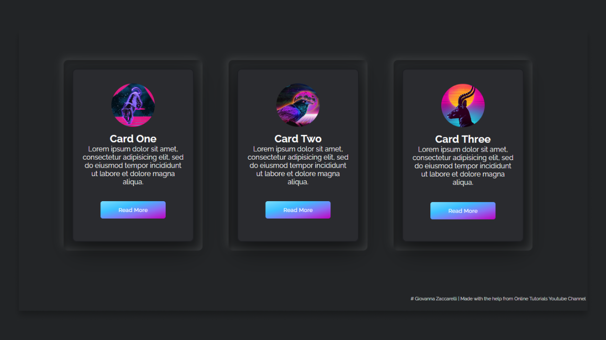
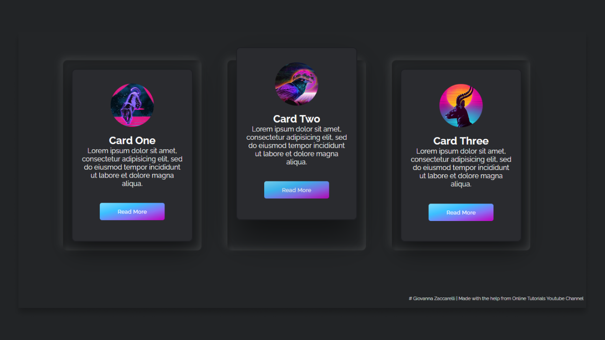
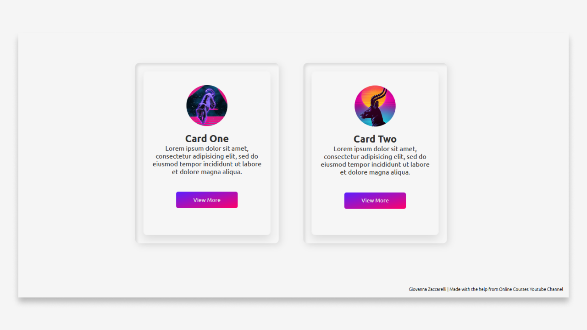

# NEUMORPHISM STUDIES

### Testing the uses of Neumorphism with HTML and CSS
#### The project was also used as a resource for a review about different colour palettes.

<h1 align="center">Dark Version</h1>

  

  

<h1 align="center">Light Version</h1>

  

